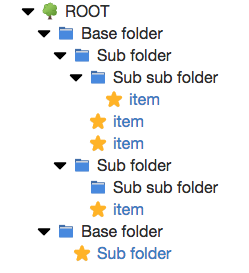

# TreeView

## Usage

Create a treeView unordered list element: `<ul class="treeView"></ul>`.
This is the base element and required for the styling and javascript to work.

Inside the `<ul>` create a list of `<li>` items representing the individual folders and items.

`<li id="" data-depth="" class=""><a href="">{ NAME }</a></li>`

List attributes: 
* id (required)
* data-depth (required)
* class (required)

List elements:
* span tag with class for icon (optional)
  * class: "folder_icon" => shows the blue folder icon
  * class: "item_icon" => shows the yellow item icon
  * empty: shows no icon
* anchor tag for items that needs a link (optional)

List class values:
  * base (required if list item is a base folder)
  * folder (required if list item is a folder)
  * item (required if list item is an item)
  * d_[number] => depth (required)
  * p_[number] => parent_id (required)
  
NOTES:
* The `data-depth` attribute and the `depth` class should have the same value.

## Styling

SASS styling is used for this repository to make use of variables.

***$text_size*** can be changed to the required value. The font and icons size will be changed with it to remain consistent with eachother.
 
***$max_depth*** can be changed to the required depth of the whole tree.

## JS

You can set the `startClosed` value to initially open or close the tree. (default: true)

JQuery is used to: 
* Create click listeners on each list item that represent a folder with child elements.
* Open / collapse folders
  * toggle the caret icon
  * show / hide child elements
  
When started closed:
* Show the tree to the selected item (if the `id` parameter is set in the url)